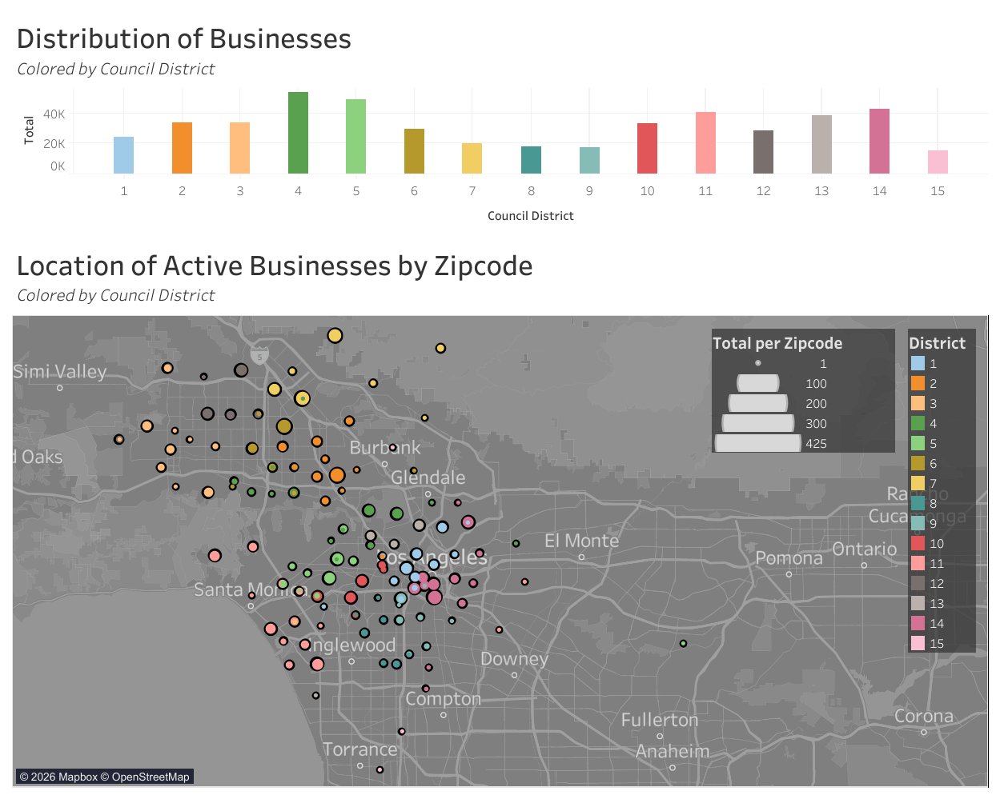

# Intro

This was my light introduction into using Tableau. While most of my work is heavily 
focused on dashboarding, I typically focus on using a PowerBI and SQL Workflow. The following 
was used to familiarize myself with Tableau (from within the web-author environment). Through 
this exercise, I took time to learn the UI, OData connection usage, and functionality of 
Tableau. The visuals provided were simple but practical enough to test measures, understand
data assumptions, filter interactions, and Tableau Sheet relationships

## Data

The data is taken from the Los Angeles [data catalog](https://data.lacity.org/Administration-Finance/Listing-of-Active-Businesses/6rrh-rzua/about_data)
which compiles several different data sets. The one used here (linked directly above) is the list of
Active Businesses compiled by the Office of Finance. The only manipulation here was excluding
businesses who were not based in the city (identified as having a council district of 0)

*Note*: While the Tableau file is provided here, the data file *is not present* to save space within the repository

## Intent

While the overall goal was to familiarize myself with a second dashboarding platform, I designed this
basic dashboard with one goal:

- Based on the Office of Finance, where are active businesses in Los Angeles?

The map visual is provided to see where these businesses geographically are, based on their zipcode. The
starting bar chart is presented to show the totals per council district.

# Preview

[Link to dashboard](https://public.tableau.com/app/profile/jonathan.lacanlale/viz/LAActiveBusinessesOpenDataset/ActiveBusinessesperCouncilDistrict#1)
