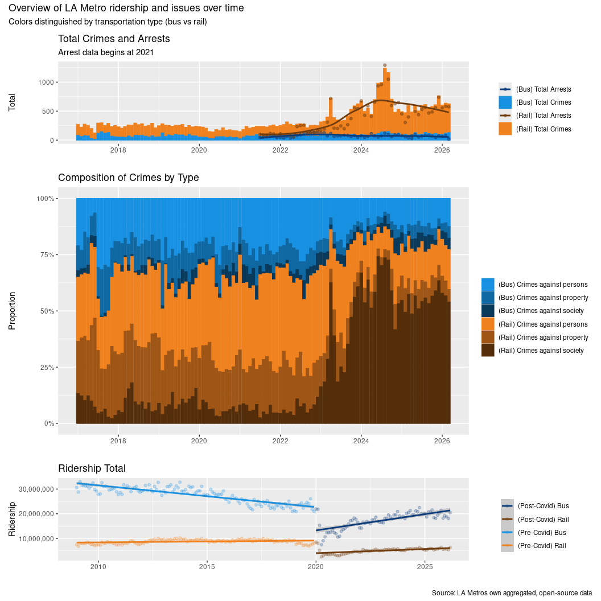

# Exploration of LA Metro’s open-source dataset


# Intro

## Visuals Covered

\[x\] Ridership of LA Metro with comparison of pre- vs post-Covid time
frames *displayed as a line and point chart*

\[x\] Total crimes and arrests recorded *displayed as a line and stacked
bar chart*

\[x\] Composition of reported crime types *displayed as proportion bar
plot*

## Data

All data displayed represented is taken from [“LA Metro’s open source
safety dataset”](https://github.com/LACMTA/data-safety).

# Visuals

## Ridership data plotted

``` r
ridership_plot <- ridership_data |>
  mutate(
    period = case_when(
      year >= 2020 ~ "Post-Covid",
      year < 2020 ~ "Pre-Covid",
    )
  ) |>
  ggplot(aes(x=date, y=count, color=interaction(type, period))) +
  geom_point(alpha=0.25) +
  scale_color_manual(
    name = "",
    values = c(
      "bus.Pre-Covid" = "#1991e3",
      "bus.Post-Covid" = "#0a3b7a",
      "rail.Pre-Covid" = "#f0811f",
      "rail.Post-Covid" = "#703c0d"
    ),
    labels = c(
      "bus.Pre-Covid" = "(Pre-Covid) Bus",
      "bus.Post-Covid" = "(Post-Covid) Bus",
      "rail.Pre-Covid" = "(Pre-Covid) Rail",
      "rail.Post-Covid" = "(Post-Covid) Rail"
    )
  ) +
  scale_x_date(name="") + 
  scale_y_continuous(name="Ridership", labels = label_comma()) +
  geom_smooth(method = "lm") +
  labs(title="Ridership Total")
```

## Arrests and Crime data combined

``` r
total_crimes_and_arrests_plot <- 
  crimes_data |>
  filter(str_detect(type, "total")) |>
  ggplot(aes(x=date, y=count, fill=type, color=type)) +
  geom_bar(stat="identity", position=position_stack(reverse = TRUE)) +
  geom_point(data=arrest_data, aes(x=date, y=count, color=type), alpha=0.50) +
  geom_smooth(data=arrest_data, aes(x=date, y=count, color=type), se=FALSE) +
  scale_color_manual(
    name = "",
    values = c(
      "bus" = "#0a3b7a",
      "bus.total" = "#1991e3",
      "rail" = "#703c0d",
      "rail.total" = "#f0811f"
    ),
    labels = c(
      "bus" = "(Bus) Total Arrests",
      "bus.total" = "(Bus) Total Crimes",
      "rail" = "(Rail) Total Arrests",
      "rail.total" = "(Rail) Total Crimes"
    )
  ) +
  scale_fill_manual(
    name = "",
    values = c(
      "bus" = "#0a3b7a",
      "bus.total" = "#1991e3",
      "rail" = "#703c0d",
      "rail.total" = "#f0811f"
    ),
    labels = c(
      "bus" = "(Bus) Total Arrests",
      "bus.total" = "(Bus) Total Crimes",
      "rail" = "(Rail) Total Arrests",
      "rail.total" = "(Rail) Total Crimes"
    )
  ) +
  scale_x_date(name="") +
  scale_y_continuous(name="Total") +
  labs(
    title="Total Crimes and Arrests",
    subtitle="Arrest data begins at 2021"
  )

crimes_broken_out_plot <-
  crimes_data |>
  filter(!str_detect(type, "total")) |>
  ggplot(aes(x=date, y=count, fill=type, color=type)) +
  geom_bar(stat="identity", position="fill") +
  scale_y_continuous(labels=scales::percent) +
  labs(y="Proportion", x="Category") +
  scale_fill_manual(
    name = "",
    values = c(
      "bus.persons" = "#1991e3",
      "bus.property" = "#1068a3",
      "bus.society" = "#093a5c",
      "rail.persons" = "#f0811f",
      "rail.property" = "#9e5515",
      "rail.society" = "#542d0a"
    ),
    labels = c(
      "bus.persons" = "(Bus) Crimes against persons",
      "bus.property" = "(Bus) Crimes against property",
      "bus.society" = "(Bus) Crimes against society",
      "rail.persons" = "(Rail) Crimes against persons",
      "rail.property" = "(Rail) Crimes against property",
      "rail.society" = "(Rail) Crimes against society"
    )
  ) +
  scale_color_manual(
    name = "",
    values = c(
      "bus.persons" = "#1991e3",
      "bus.property" = "#1068a3",
      "bus.society" = "#093a5c",
      "rail.persons" = "#f0811f",
      "rail.property" = "#9e5515",
      "rail.society" = "#542d0a"
    ),
    labels = c(
      "bus.persons" = "(Bus) Crimes against persons",
      "bus.property" = "(Bus) Crimes against property",
      "bus.society" = "(Bus) Crimes against society",
      "rail.persons" = "(Rail) Crimes against persons",
      "rail.property" = "(Rail) Crimes against property",
      "rail.society" = "(Rail) Crimes against society"
    )
  ) +
  scale_x_date(name="") + 
  labs(title="Composition of Crimes by Type")
```

## Compiled Presentation

``` r
(total_crimes_and_arrests_plot / crimes_broken_out_plot / ridership_plot) + 
  plot_layout(heights = c(1, 3, 1)) +
  plot_annotation(
    title = 'Overview of LA Metro ridership and issues over time',
    subtitle = 'Colors distinguished by transportation type (bus vs rail)',
    caption = 'Source: LA Metros own aggregated, open-source data'
  )
```

    `geom_smooth()` using method = 'loess' and formula = 'y ~ x'
    `geom_smooth()` using formula = 'y ~ x'


