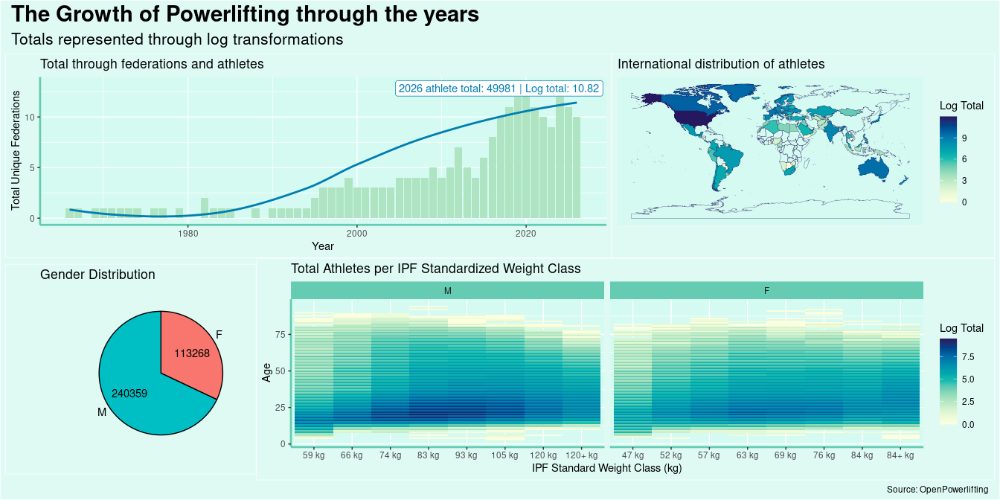
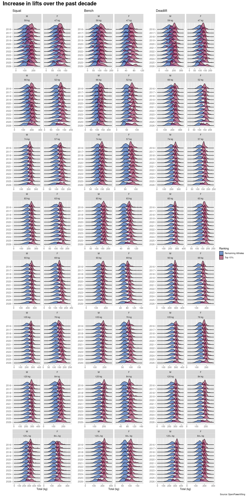

# Powerlifting Meet Performances across Divisions


# Intro

## Visuals Covered

The following was compiled as a “poster”-experiment. The visuals
presented here are compiled via the `patchwork` library to create a
similar output commonly seen in research poster presentations. Two
poster options (one horizontal, one vertical) are presented, both
focusing on their own “research” questions.

\[x\] *Poster One - Horizontal Format* : The international growth of
powerlifting at micro- and macro- level scales

\[x\] *Poster Two - Vertical Format* : Increase in Big 3 Bests over time

## Data

All data displayed and represented is taken from [“OpenPLs free
open-source dataset on powerlifting
meets”](https://openpowerlifting.gitlab.io/opl-csv/a).

# Cleaning

``` r
summary(data)
```

         Name               Sex               Event            Equipment        
     Length:3958742     Length:3958742     Length:3958742     Length:3958742    
     Class :character   Class :character   Class :character   Class :character  
     Mode  :character   Mode  :character   Mode  :character   Mode  :character  
                                                                                
                                                                                
                                                                                
                                                                                
          Age            AgeClass         BirthYearClass       Division        
     Min.   :  0.00    Length:3958742     Length:3958742     Length:3958742    
     1st Qu.: 20.50    Class :character   Class :character   Class :character  
     Median : 27.00    Mode  :character   Mode  :character   Mode  :character  
     Mean   : 30.64                                                            
     3rd Qu.: 38.00                                                            
     Max.   :105.50                                                            
     NA's   :1453149                                                           
      BodyweightKg    WeightClassKg         Squat1Kg          Squat2Kg      
     Min.   : 15.00   Length:3958742     Min.   :-555.0    Min.   :-600.0   
     1st Qu.: 66.80   Class :character   1st Qu.:  92.5    1st Qu.:  85.0   
     Median : 81.60   Mode  :character   Median : 147.5    Median : 150.0   
     Mean   : 83.75                      Mean   : 117.8    Mean   : 103.7   
     3rd Qu.: 98.30                      3rd Qu.: 197.5    3rd Qu.: 202.5   
     Max.   :300.00                      Max.   : 560.0    Max.   : 577.5   
     NA's   :44279                       NA's   :2674518   NA's   :2687861  
        Squat3Kg       Squat4Kg        Best3SquatKg        Bench1Kg      
     Min.   :-600.5    Mode:logical   Min.   :-508.0    Min.   :-635.50  
     1st Qu.:-146.5    NA's:3958742   1st Qu.: 120.0    1st Qu.:  57.50  
     Median : 120.0                   Median : 165.6    Median : 100.00  
     Mean   :  45.1                   Mean   : 171.0    Mean   :  84.02  
     3rd Qu.: 195.0                   3rd Qu.: 215.0    3rd Qu.: 140.00  
     Max.   : 595.0                   Max.   : 595.0    Max.   : 659.00  
     NA's   :2718626                  NA's   :1194057   NA's   :2096169  
        Bench2Kg          Bench3Kg          Bench4Kg        Best3BenchKg   
     Min.   :-635.50   Min.   :-589.99   Min.   :-590.0    Min.   :-522.5  
     1st Qu.:  37.50   1st Qu.:-130.00   1st Qu.:-117.5    1st Qu.:  72.5  
     Median :  95.00   Median : -55.00   Median :  73.0    Median : 111.1  
     Mean   :  59.67   Mean   : -11.84   Mean   :  23.5    Mean   : 114.6  
     3rd Qu.: 140.00   3rd Qu.: 115.00   3rd Qu.: 149.7    3rd Qu.: 147.5  
     Max.   : 530.00   Max.   : 635.50   Max.   : 567.4    Max.   : 659.0  
     NA's   :2117693   NA's   :2171275   NA's   :3934386   NA's   :447732  
      Deadlift1Kg       Deadlift2Kg       Deadlift3Kg       Deadlift4Kg     
     Min.   :-500.0    Min.   :-502.5    Min.   :-587.50   Min.   :-500.0   
     1st Qu.: 125.0    1st Qu.: 120.0    1st Qu.:-200.00   1st Qu.:-107.5   
     Median : 180.0    Median : 180.0    Median : 127.50   Median : 142.5   
     Mean   : 160.4    Mean   : 136.8    Mean   :  26.11   Mean   :  76.7   
     3rd Qu.: 222.5    3rd Qu.: 230.0    3rd Qu.: 207.50   3rd Qu.: 205.0   
     Max.   : 458.0    Max.   : 470.0    Max.   : 487.50   Max.   : 520.0   
     NA's   :2521604   NA's   :2546085   NA's   :2596645   NA's   :3931008  
     Best3DeadliftKg     TotalKg          Place                Dots       
     Min.   :-410.0   Min.   :   1.0   Length:3958742     Min.   :  0.68  
     1st Qu.: 137.5   1st Qu.: 212.5   Class :character   1st Qu.:163.97  
     Median : 185.0   Median : 360.0   Mode  :character   Median :302.37  
     Mean   : 186.5   Mean   : 380.4                      Mean   :280.34  
     3rd Qu.: 231.3   3rd Qu.: 532.5                      3rd Qu.:373.73  
     Max.   : 487.5   Max.   :1407.5                      Max.   :818.06  
     NA's   :991202   NA's   :267337                      NA's   :293460  
         Wilks         Glossbrenner       Goodlift         Tested         
     Min.   :  0.67   Min.   :  0.64   Min.   :  0.50   Length:3958742    
     1st Qu.:163.31   1st Qu.:153.32   1st Qu.: 52.46   Class :character  
     Median :301.25   Median :280.30   Median : 64.24   Mode  :character  
     Mean   :279.19   Mean   :262.31   Mean   : 64.40                     
     3rd Qu.:372.00   3rd Qu.:351.39   3rd Qu.: 75.88                     
     Max.   :813.18   Max.   :756.90   Max.   :182.71                     
     NA's   :293460   NA's   :293460   NA's   :597449                     
       Country             State            Federation        ParentFederation  
     Length:3958742     Length:3958742     Length:3958742     Length:3958742    
     Class :character   Class :character   Class :character   Class :character  
     Mode  :character   Mode  :character   Mode  :character   Mode  :character  
                                                                                
                                                                                
                                                                                
                                                                                
          Date            MeetCountry         MeetState           MeetTown        
     Min.   :1964-09-05   Length:3958742     Length:3958742     Length:3958742    
     1st Qu.:2013-05-12   Class :character   Class :character   Class :character  
     Median :2018-05-05   Mode  :character   Mode  :character   Mode  :character  
     Mean   :2015-11-19                                                           
     3rd Qu.:2023-01-26                                                           
     Max.   :2026-06-21                                                           
                                                                                  
       MeetName          Sanctioned       
     Length:3958742     Length:3958742    
     Class :character   Class :character  
     Mode  :character   Mode  :character  
                                          
                                          
                                          
                                          

``` r
data |>
  select(
    where(is.character) 
    & !Name
    & !MeetState
    & !MeetCountry
    & !MeetTown
    & !MeetName
    & !Division
    & !Place
  ) |>
  lapply(unique)
```

    $Sex
    [1] "F"  "M"  "Mx"

    $Event
    [1] "B"   "S"   "D"   "BD"  "SBD" "SD"  "SB" 

    $Equipment
    [1] "Raw"        "Wraps"      "Multi-ply"  "Single-ply" "Unlimited" 
    [6] "Straps"    

    $AgeClass
     [1] "24-34"  "40-44"  "20-23"  "35-39"  "50-54"  "18-19"  "16-17"  "13-15" 
     [9] NA       "60-64"  "70-74"  "5-12"   "45-49"  "55-59"  "65-69"  "75-79" 
    [17] "80-84"  "85-89"  "90-999"

    $BirthYearClass
    [1] "24-39"  "40-49"  "19-23"  "50-59"  "14-18"  NA       "60-69"  "70-999"

    $WeightClassKg
      [1] NA       "82.5"   "90"     "100"    "100+"   "67.5"   "75"     "110"   
      [9] "125"    "125+"   "56"     "60"     "90+"    "44"     "48"     "52"    
     [17] "140"    "140+"   "49"     "54"     "59"     "65"     "72"     "80"    
     [25] "88"     "97"     "107"    "107+"   "41"     "55"     "61"     "73"    
     [33] "86+"    "45"     "50"     "67"     "79"     "86"     "40"     "82.5+" 
     [41] "57"     "85+"    "67.5+"  "55+"    "51"     "85"     "110+"   "58"    
     [49] "64"     "62"     "69"     "77"     "94"     "105"    "120"    "53"    
     [57] "84"     "120+"   "95"     "84+"    "76"     "93"     "83"     "74"    
     [65] "66"     "63"     "47"     "43"     "76+"    "105+"   "72+"    "75+"   
     [73] "56+"    "60+"    "1+"     "95+"    "+"      "68.5"   "69.5"   "70.5"  
     [81] "53+"    "52.5"   "83+"    "63+"    "70"     "70+"    "115"    "69+"   
     [89] "74+"    "93+"    "35"     "30"     "145"    "145+"   "34.9"   "20"    
     [97] "90.2"   "85.7"   "135+"   "135"    "62.5"   "80+"    "66+"    "117.5" 
    [105] "118"    "79.8"   "102.5"  "113.8"  "125.1"  "82.1"   "91.1"   "63.9"  
    [113] "68.4"   "136.5+" "136.5"  "75.2"   "113.8+" "54.8"   "91.1+"  "100.2" 
    [121] "125.1+" "79.8+"  "51.7"   "55.7"   "59.8"   "65.7"   "70.3"   "74.8"  
    [129] "93.8"   "99.7"   "109.7"  "124.7"  "124.7+" "47.6"   "67.1"   "89.8"  
    [137] "99.7+"  "57+"    "55.5"   "58.5"   "47.5"   "50.5"   "37"     "115+"  
    [145] "44.5"   "130"    "130+"   "58.9"   "72.5"   "72.5+"  "45.8"   "49.9"  
    [153] "53.9"   "69.8"   "76.6"   "90.2+"  "99.3"   "107.9"  "107.9+" "44.2"  
    [161] "47.8"   "51.9"   "60.1"   "67.3"   "82.3"   "117.7"  "117.7+" "82"    
    [169] "82+"    "52+"    "46"     "39"     "90.7"   "90.7+"  "31"     "38"    
    [177] "33"     "68"     "117.5+" "45.3"   "136"    "136+"   "36.2"   "27.5"  
    [185] "34"     "27.2"   "139.7"  "139.7+" "63.5"   "89"     "95.5"   "101.5" 
    [193] "132"    "148"    "165"    "181"    "198"    "220"    "242"    "275"   
    [201] "79.3"   "102"    "81.5"   "81.5+"  "52.1"   "56.7"   "61.2"   "83.9"  
    [209] "88.4"   "95.2"   "102+"   "92.9"   "92.9+"  "215"    "123.3"  "63.7"  
    [217] "112"    "75.8"   "129"    "106"    "88.2"   "103.3"  "108"    "86.8"  
    [225] "99.5"   "103"    "79.5"   "90.5"   "90.5+"  "77.1"   "86.1"   "104.3" 
    [233] "104.3+" "41+"    "81.6"   "83.5"   "84.5"   "85.5"   "86.5"   "87.5"  
    [241] "88.5"   "89.5"   "88.9"   "88.9+"  "113.4"  "113.4+" "38.5"   "46.2"  
    [249] "58.5+"  "95.2+"  "68.9"   "78.9"   "127"    "127+"   "54.4"   "78.9+" 
    [257] "42.1"   "47.1"   "79.3+"  "144.5"  "91"     "92"     "96"     "98"    
    [265] "57.5"   "111"    "113"    "114"    "71"     "84.8"   "104.4"  "82.4"  
    [273] "135.9"  "65.3"   "77.7"   "84.1"   "80.2"   "103.4"  "98.1"   "98.8"  
    [281] "146.6"  "73.7"   "86.2"   "94.3"   "111.7"  "91.4"   "83.6"   "97.2"  
    [289] "74.6"   "70.7"   "78.4"   "275+"   "43.5"   "126"    "83.9+"  "68+"   
    [297] "67.6"   "128"    "142.8"  "102.9"  "64.4"   "64.4+"  "80.7"   "88.4+" 
    [305] "123"    "82.9"   "117.9"  "117.9+" "42"     "56.4"   "63.5+"  "111.1" 
    [313] "81"     "96+"    "57.1"   "89+"    "36.5"   "41.7"   "91+"    "72.6+" 
    [321] "81.6+"  "58.9+"  "73.5"   "92.5"   "101.5+" "94.8"   "103.8"  "103.8+"
    [329] "53.5"   "57.6"   "61.6"   "91.6"   "101.6"  "111.5"  "126.5"  "113.5" 
    [337] "143"    "143+"   "54.5"   "103.2"  "109"    "108.2"  "97.6"   "122"   
    [345] "142.5"  "78"     "83.3"   "61.5"   "108.5"  "119"    "144.5+" "61.2+" 
    [353] "40.8"   "56.7+"  "32.2"   "37.1"   "54.4+"  "77.5"   "76.2"   "101.6+"
    [361] "60.5"   "48.5"   "94.5"   "80.5"   "97.5"   "32"     "36"     "109+"  
    [369] "61+"    "47+"    "155"    "87"     "155+"   "25"     "82.6"   "101+"  
    [377] "103+"   "104+"   "150"    "200"    "160"    "180"    "53.8"   "57.8"  
    [385] "61.8"   "69.3"   "76.8"   "84.3"   "91.8"   "101.8"  "111.8"  "126.8" 
    [393] "141.8"  "141.8+" "64+"    "-74"    "-93"    "56.5"   "113.5+" "104.7" 
    [401] "104.7+" "120.2"  "120.2+" "108+"  

    $Tested
    [1] NA    "Yes"

    $Country
      [1] "Belarus"                  NA                        
      [3] "USA"                      "Finland"                 
      [5] "Canada"                   "Czechia"                 
      [7] "Estonia"                  "Hungary"                 
      [9] "Brazil"                   "Russia"                  
     [11] "Germany"                  "Sweden"                  
     [13] "Iceland"                  "Spain"                   
     [15] "Poland"                   "Kazakhstan"              
     [17] "Portugal"                 "Croatia"                 
     [19] "UK"                       "Norway"                  
     [21] "Japan"                    "Ireland"                 
     [23] "Belgium"                  "Austria"                 
     [25] "France"                   "Australia"               
     [27] "Latvia"                   "Lithuania"               
     [29] "Saudi Arabia"             "Jordan"                  
     [31] "UAE"                      "Iraq"                    
     [33] "Syria"                    "Venezuela"               
     [35] "Colombia"                 "Cuba"                    
     [37] "Chile"                    "Honduras"                
     [39] "Mexico"                   "Guatemala"               
     [41] "El Salvador"              "Argentina"               
     [43] "Nicaragua"                "Costa Rica"              
     [45] "Ecuador"                  "Haiti"                   
     [47] "Iran"                     "Malaysia"                
     [49] "Indonesia"                "Uzbekistan"              
     [51] "Vietnam"                  "Bahrain"                 
     [53] "China"                    "India"                   
     [55] "Azerbaijan"               "Algeria"                 
     [57] "Ukraine"                  "Turkey"                  
     [59] "Thailand"                 "Peru"                    
     [61] "Cameroon"                 "Egypt"                   
     [63] "South Korea"              "Italy"                   
     [65] "Philippines"              "Ivory Coast"             
     [67] "South Africa"             "Nigeria"                 
     [69] "Greece"                   "Libya"                   
     [71] "Dominican Republic"       "Georgia"                 
     [73] "Armenia"                  "Panama"                  
     [75] "Turkmenistan"             "Kenya"                   
     [77] "Ghana"                    "Scotland"                
     [79] "Serbia"                   "Moldova"                 
     [81] "Mongolia"                 "New Zealand"             
     [83] "Singapore"                "Kyrgyzstan"              
     [85] "The Gambia"               "England"                 
     [87] "Morocco"                  "Taiwan"                  
     [89] "Cyprus"                   "Netherlands"             
     [91] "Israel"                   "Papua New Guinea"        
     [93] "Namibia"                  "Hong Kong"               
     [95] "Tajikistan"               "East Timor"              
     [97] "Slovakia"                 "Benin"                   
     [99] "Bulgaria"                 "Romania"                 
    [101] "Laos"                     "Sri Lanka"               
    [103] "Oman"                     "Kuwait"                  
    [105] "Uganda"                   "Pakistan"                
    [107] "Vanuatu"                  "Niger"                   
    [109] "Afghanistan"              "Qatar"                   
    [111] "Switzerland"              "Lebanon"                 
    [113] "Jamaica"                  "Congo"                   
    [115] "Togo"                     "Angola"                  
    [117] "Rwanda"                   "Ethiopia"                
    [119] "Central African Republic" "Sierra Leone"            
    [121] "Zambia"                   "Gabon"                   
    [123] "Nepal"                    "Burkina Faso"            
    [125] "Mali"                     "Senegal"                 
    [127] "Aruba"                    "Puerto Rico"             
    [129] "Tanzania"                 "Paraguay"                
    [131] "Slovenia"                 "Yemen"                   
    [133] "Wales"                    "Liberia"                 
    [135] "Tunisia"                  "Denmark"                 
    [137] "West Germany"             "Brunei"                  
    [139] "Rhodesia"                 "Fiji"                    
    [141] "Montenegro"               "Myanmar"                 
    [143] "Sudan"                    "Comoros"                 
    [145] "Bahamas"                  "Cabo Verde"              
    [147] "Lesotho"                  "Luxembourg"              
    [149] "Mauritania"               "Guinea"                  
    [151] "USSR"                     "Guinea-Bissau"           
    [153] "Wallis and Futuna"        "Nauru"                   
    [155] "US Virgin Islands"        "N.Ireland"               
    [157] "Uruguay"                  "Belize"                  
    [159] "Guyana"                   "American Samoa"          
    [161] "Malta"                    "Bolivia"                 
    [163] "Zimbabwe"                 "Samoa"                   
    [165] "Trinidad and Tobago"      "Kiribati"                
    [167] "Netherlands Antilles"     "Tonga"                   
    [169] "Cayman Islands"           "Palestine"               
    [171] "Yugoslavia"               "Serbia and Montenegro"   
    [173] "New Caledonia"            "Suriname"                
    [175] "Bangladesh"               "Djibouti"                
    [177] "Bosnia and Herzegovina"   "Grenada"                 
    [179] "Tuvalu"                   "Niue"                    
    [181] "Solomon Islands"          "British Virgin Islands"  
    [183] "Isle of Man"              "Tahiti"                  
    [185] "French Polynesia"         "North Macedonia"         
    [187] "Transnistria"             "Cambodia"                
    [189] "Albania"                  "Eswatini"                
    [191] "Botswana"                 "Cook Islands"            
    [193] "Czechoslovakia"           "Madagascar"              
    [195] "Gibraltar"                "Abkhazia"                
    [197] "Mauritius"               

    $State
      [1] NA    "NC"  "QC"  "OK"  "MD"  "IL"  "MA"  "AZ"  "ON"  "AB"  "OH"  "PA" 
     [13] "IN"  "IA"  "GA"  "NJ"  "MI"  "MN"  "NY"  "CA"  "SK"  "WA"  "CO"  "TX" 
     [25] "NH"  "FL"  "KY"  "BC"  "MO"  "WI"  "KS"  "CT"  "NE"  "NB"  "QLD" "NSW"
     [37] "ACT" "VIC" "VA"  "WV"  "DE"  "TN"  "DC"  "HI"  "UT"  "AL"  "SC"  "VT" 
     [49] "ND"  "NV"  "OR"  "NM"  "LA"  "AK"  "MS"  "ME"  "AR"  "SA"  "TAS" "NT" 
     [61] "JY"  "CB"  "BA"  "NQ"  "SL"  "RN"  "SJ"  "MZ"  "CN"  "ER"  "TM"  "SF" 
     [73] "WY"  "RI"  "SD"  "MT"  "ID"  "NS"  "PE"  "NL"  "MB"  "VE"  "QT"  "CS" 
     [85] "DF"  "CH"  "CM"  "SI"  "QR"  "YU"  "TB"  "SO"  "EM"  "NW"  "SM"  "BOP"
     [97] "AKL" "GU"  "GT"  "MP"  "WC"  "PR"  "SP"  "RS"  "MG"  "RJ"  "CE"  "AP" 
    [109] "RR"  "AM"  "PB"  "GO"  "ES"  "ZH"  "GE"  "WB"  "MH"  "JH"  "CG"  "GR" 
    [121] "BS"  "JA"  "HG"  "AG"  "EC"  "KZN" "FS"  "RO"  "WGN" "WKO" "HKB" "CAN"
    [133] "NTL" "MBH" "SW"  "WM"  "YNE" "GL"  "SE"  "GD"  "HUB" "HEB" "JX"  "JS" 
    [145] "ZJ"  "AH"  "YN"  "FJ"  "JL"  "HEN" "HUN" "LN"  "LP"  "BY"  "HE"  "NRW"
    [157] "BW"  "MV"  "BB"  "RP"  "NI"  "YT"  "NU" 

    $Federation
      [1] "GSF-Belarus"     "WPFG"            "WPC-Latvia"      "WPPO"           
      [5] "WPC-UKR"         "WRPF-Slovakia"   "WRPF"            "WP-China"       
      [9] "WUAP"            "IPL-Hungary"     "SPSS"            "WPPL-Ireland"   
     [13] "APLA"            "IPF"             "KRAFT"           "EPF"            
     [17] "GPA"             "UPC"             "IBSA"            "WUAP-SVK"       
     [21] "WPC-SVK"         "USPC"            "FDNLP"           "KNKF-SP"        
     [25] "RawIronPL"       "BPC"             "LPF"             "LJTF"           
     [29] "WRPF-France"     "IPL"             "IPL-Russia"      "WPPL-Brazil"    
     [33] "PHPL"            "CPI"             "IPL-China"       "FRPL"           
     [37] "PA"              "WP"              "AAP"             "AmericanSA"     
     [41] "WRPF-Lithuania"  "FPP"             "NAPF"            "UgandaPA"       
     [45] "CAST"            "SAST"            "CTPA"            "URPF"           
     [49] "GPA-COL"         "WRPF-Belarus"    "WRPF-Colombia"   "CPO"            
     [53] "FFForce"         "DBKV"            "WUAP-USA"        "IPL-Colombia"   
     [57] "WPC-Finland"     "WPC"             "GPL"             "HPF"            
     [61] "WPPL-Mexico"     "GPC-GB"          "WRPF-UK"         "Poland-UA"      
     [65] "GPC-RUS"         "WRPF-Costa"      "GPC-UKR"         "AsianPF"        
     [69] "WP-Lanka"        "WPC-Moldova"     "FESUPO"          "WRPF-India"     
     [73] "AAU"             "GPC-CRO"         "GPU"             "GlobalPU"       
     [77] "VietnamPA"       "GPC-AUS"         "Qatar-UA"        "WRPF-CRO"       
     [81] "WRPF-SRB"        "WRPF-Sweden"     "ESDT"            "WRPF-Spain"     
     [85] "WPC-KAZ"         "GFP"             "BPU"             "WP-USA"         
     [89] "Hunpower"        "XPS"             "WarriorPLF"      "PLZS"           
     [93] "WPC-Israel"      "HPLS-UA"         "AfricanPF"       "RawPower"       
     [97] "UAE-UA"          "GPA-Russia"      "WPSF-Belarus"    "WPC-Korea"      
    [101] "TaiwanUA"        "ProRaw"          "XPC-Poland"      "AusPL"          
    [105] "SVNL"            "NSF"             "WRPF-POL"        "ScottishPL"     
    [109] "FPO"             "IPA"             "MaltaPA"         "WRPF-CAN"       
    [113] "SPF"             "Hardcore"        "WPUF"            "WRPF-HUN"       
    [117] "MHSPLA"          "LGBT"            "ILPA"            "EJTL"           
    [121] "PWFL"            "BDFPF"           "POSK"            "JPA"            
    [125] "WRPF-Cameroon"   "LMP"             "RAWU"            "WPC-Poland"     
    [129] "Portugal-UA"     "WelshPA"         "WPRO"            "WRPF-Portugal"  
    [133] "WRPF-Italy"      "WPO"             "CAPO"            "CAPO-NZ"        
    [137] "SwissPL"         "WPPL"            "NPA"             "IPA-AZE"        
    [141] "ARPL"            "APPortugal"      "FCLP"            "GPC"            
    [145] "GRAWA"           "FAPL"            "England-UA"      "KBGV"           
    [149] "VGPF"            "WPA-Poland"      "NauruPF"         "RAW"            
    [153] "RAW-CAN"         "IDFPA"           "RAW-UKR"         "IDFPF"          
    [157] "HPO"             "FBPD"            "VNPL"            "GPF"            
    [161] "GPA-CRO"         "DSF"             "PRPA"            "PLRD"           
    [165] "FECAPOLIF"       "MDFPF"           "PFBD"            "TAAP"           
    [169] "WUAP-Germany"    "USAPL"           "FHSAA"           "WRPF-DE"        
    [173] "WRPF-Iceland"    "IKF"             "WPPL-Russia"     "UPA"            
    [177] "RhinoPC"         "APParaguay"      "CBLB"            "GPC-ISR"        
    [181] "XPC"             "INTDFPA"         "THSWPA"          "Germany-UA"     
    [185] "RDFPF"           "WRPF-Serbia"     "FIAP"            "WUAP-CRO"       
    [189] "FCST"            "FEDELEPO"        "APU"             "ORPF"           
    [193] "CPF"             "WPC-India"       "IrishPF"         "NPB"            
    [197] "SDFPF"           "PLTRAW"          "NZ-UA"           "WPF-KRAWA"      
    [201] "Netherlands-UA"  "WRPF-Bolivia"    "Fedepotencia"    "BelPF"          
    [205] "NORCAL"          "SAFKST"          "IranBBF"         "DPL"            
    [209] "TPSSF"           "UgandaPF"        "UDFPF"           "VDFPA"          
    [213] "ACHIPO"          "ThaiPF"          "AFPF"            "SCT"            
    [217] "IronBoy"         "CHNPL"           "WRPF-Venezuela"  "USPF"           
    [221] "APO"             "PI"              "GAPLF"           "AusDFPF"        
    [225] "WPC-RUS"         "WPA"             "PAP"             "Russia-UA"      
    [229] "UKPU"            "LFPH"            "WPPL-Peru"       "WUAP-AUT"       
    [233] "NMAA"            "UAEPL"           "BB"              "WP-India"       
    [237] "WNPF"            "ADFPF"           "WRPF-Vietnam"    "GPC-CAN"        
    [241] "PZKFiTS"         "FEMEPO"          "MDFPA"           "SLP"            
    [245] "SAPF"            "WRPF-Brazil"     "GPC-NZ"          "BVDG"           
    [249] "WPPL-Belarus"    "Croatia-UA"      "WPC-Iceland"     "PRIDE"          
    [253] "HKPF"            "BAWLA"           "EPA"             "BPF"            
    [257] "APF"             "WPC-France"      "THSPA"           "WRPF-Nepal"     
    [261] "ABS"             "WPU"             "BP"              "GPC-IRL"        
    [265] "BPO"             "CPU"             "NZAWLA"          "AIWBPA"         
    [269] "OceaniaPF"       "AusPF"           "PNGPF"           "BVDK"           
    [273] "AWF"             "ADFPA"           "WDFPF"           "USA-UA"         
    [277] "WABDL"           "NASA"            "USMilAbroad"     "APA"            
    [281] "SCI"             "WBC"             "KPF"             "NordicPF"       
    [285] "ADAU"            "SSF"             "WPC-Germany"     "NZPF"           
    [289] "Canada-UA"       "ANPPC"           "SaudiUA"         "NaturalPA"      
    [293] "AAPLF"           "LHSPLA"          "INSA"            "CBPL"           
    [297] "BahamasPF"       "MHSAA"           "ColPF"           "FPR"            
    [301] "SSA"             "Malaysia-UA"     "USARawBP"        "FIPL"           
    [305] "SAAS"            "CSST"            "PoliceAL"        "WPF"            
    [309] "FCA"             "CPC"             "WSHSPL"          "CNFA"           
    [313] "EPC"             "BDFPA"           "FALPO"           "WAIA"           
    [317] "USABA"           "AEP"             "IrishPO"         "WPC-KGZ"        
    [321] "KuwaitPL"        "Korea-UA"        "MM-AUS"          "IPL-NZ"         
    [325] "GPC-POL"         "Madagascar-UA"   "Argentina-UA"    "IPF-China"      
    [329] "WRPF-UAE"        "FCP"             "HTPL"            "GPC-Portugal"   
    [333] "GPC-Brazil"      "WUAP-CZ"         "Turkey-UA"       "WPA-RUS"        
    [337] "WP-Nauru"        "Finland-UA"      "WPPL-Georgia"    "APUA"           
    [341] "WRPF-Latvia"     "SPF-IRL"         "AmPU"            "GPC-LAT"        
    [345] "USPA"            "CPL"             "WRPF-Ireland"    "WRPF-NIC"       
    [349] "ABP"             "WP-Niue"         "USSports"        "WRPF-KAZ"       
    [353] "SPA"             "WPC-Portugal"    "UK-UA"           "GPC-Scotland"   
    [357] "WPLeague"        "WPC-Egypt"       "IPC"             "NZPU"           
    [361] "PLH"             "NIPF"            "ManxPL"          "PLU"            
    [365] "RPS"             "GPC-USA"         "NextGenPF"       "IPL-Chile"      
    [369] "WPC-SA"          "WRPF-Qatar"      "ACPA"            "WPPL-Ukraine"   
    [373] "FFHMFAC"         "WRPF-Ecuador"    "UkrainePO"       "UKIPL"          
    [377] "BulgarianPF"     "WP-NZ"           "CyprusPF"        "WPA-GEO"        
    [381] "IHSPLA"          "USVIPF"          "WUAP-RUS"        "GPA-Brazil"     
    [385] "FECHIPO"         "WRPF-EIRE"       "OEVK"            "GPC-France"     
    [389] "WRPF-Chile"      "FPPR"            "TTPF"            "SSAU"           
    [393] "NAP"             "Vityaz"          "WPF-RUS"         "VPF"            
    [397] "AMP"             "Ireland-UA"      "GPC-GUPU"        "UkrainePA"      
    [401] "Vietnam-UA"      "ILPF"            "OceaniaPO"       "WPC-Italy"      
    [405] "PFA"             "HKWPA"           "WRPF-Bulgaria"   "NYFC"           
    [409] "RPU"             "Italy-UA"        "UPC-Germany"     "DFPFNL"         
    [413] "WRPF-Argentina"  "KDKS"            "WRPF-Slovenia"   "BPA"            
    [417] "FSFA"            "Czechia-UA"      "KPC"             "SADFPA"         
    [421] "WRPF-Peru"       "UPL"             "INPF"            "WRPF-AUS"       
    [425] "GPA-Finland"     "FMPB"            "IPL-Spain"       "MPA"            
    [429] "PS"              "WPCCP"           "ChinaPA"         "CPA"            
    [433] "CommonwealthPF"  "APC"             "IPL-Italy"       "RAW-Iceland"    
    [437] "NPAJ"            "PLSS"            "NOVA"            "RUPC"           
    [441] "CRPL"            "MM"              "365Strong"       "WRPF-HON"       
    [445] "WPPL-Argentina"  "GDFPF"           "USSF"            "HPC"            
    [449] "WPPL-Kazakhstan" "FIPE"            "UkrainePF"       "WRPF-MEX"       
    [453] "FELIPOME"        "DDFPA"           "USABPA"          "MAP"            
    [457] "PAGermany"       "UnifiedSA"       "HPLS"            "USPS"           
    [461] "NPL"             "QatarPL"         "Hungary-UA"      "IRP"            
    [465] "FEPOA"           "WPAU"            "SSSC"           

    $ParentFederation
     [1] NA        "WPC"     "WRPF"    "WP"      "WUAP"    "IPL"     "WPPL"   
     [8] "IPF"     "GPA"     "UPC"     "WPA"     "GPC"     "WPU"     "WPSF"   
    [15] "XPC"     "IPA"     "WDFPF"   "WPO"     "IRP"     "INTDFPA" "RAW"    
    [22] "IDFPA"   "WPF"     "IBSA"    "MM"      "WABDL"   "SPF"    

    $Sanctioned
    [1] "Yes" "No" 

``` r
data$Date <- ymd(data$Date)
data$Year <- year(data$Date)
data <-
    data |>
      filter(Event == "SBD" & Equipment == "Raw" & Tested == "Yes")

data <- data |>
  mutate(
    IPFWeightClassKG = 
      case_when(
        Sex == "M" ~
          case_when(
            is.na(BodyweightKg) ~ "Unknown",
            BodyweightKg <= 59 ~ "59 kg",
            BodyweightKg > 59 & BodyweightKg <= 66 ~ "66 kg",
            BodyweightKg > 66 & BodyweightKg <= 74 ~ "74 kg",
            BodyweightKg > 74 & BodyweightKg <= 83 ~ "83 kg",
            BodyweightKg > 83 & BodyweightKg <= 93 ~ "93 kg",
            BodyweightKg > 93 & BodyweightKg <= 105 ~ "105 kg",
            BodyweightKg > 105 & BodyweightKg <= 120 ~ "120 kg",
            TRUE ~ "120+ kg"
          ),
        TRUE ~ 
          case_when(
            is.na(BodyweightKg) ~ "Unknown",
            BodyweightKg <= 47 ~ "47 kg",
            BodyweightKg > 47 & BodyweightKg <= 52 ~ "52 kg",
            BodyweightKg > 52 & BodyweightKg <= 57 ~ "57 kg",
            BodyweightKg > 57 & BodyweightKg <= 63 ~ "63 kg",
            BodyweightKg > 63 & BodyweightKg <= 69 ~ "69 kg",
            BodyweightKg > 69 & BodyweightKg <= 76 ~ "76 kg",
            BodyweightKg > 76 & BodyweightKg <= 84 ~ "84 kg",
            TRUE ~ "84+ kg"
          )
      )
  )

data$IPFWeightClassKG <- factor(
  data$IPFWeightClassKG,
  levels = c(
        "47 kg",
        "52 kg",  
        "57 kg",
        "59 kg", 
        "63 kg",
        "66 kg",
        "69 kg",  
        "74 kg", 
        "76 kg", 
        "83 kg",
        "84 kg", 
        "84+ kg",
        "93 kg",
        "105 kg", 
        "120 kg", 
        "120+ kg",
        "Unknown"
      )
  )

data$Age <- round(data$Age)

data$CountryFormatted <- country_name(data$Country, to = "name_en") 
```

    Some country IDs have no match in one or more of the requested country naming conventions, NA returned.

    Multiple country IDs have been matched to the same country name.

    There is low confidence on the matching of some country names, NA returned.


    Set - verbose - to TRUE for more details

``` r
world_map <- ne_countries(scale = "medium", returnclass = "sf")

# Excluded from native `countries` library
data |>
  select(c(Country, CountryFormatted)) |>
  filter(is.na(CountryFormatted) & !is.na(Country)) |>
  select(Country) |>
  lapply(unique)
```

    $Country
    [1] "Tahiti"       "USSR"         "Transnistria"

# Poster 1: The interntational growth of powerlifting at micro- and macro- level scales

## Visuals

``` r
poster_1_data <- data |>
  filter(
      IPFWeightClassKG != "Unknown" &
      Sex != "Mx"
  )

panel_background_color <- "#d4faf1"
poster_background <- "#defaf3"
```

### Total federations and athletes over time

``` r
func_counts <- function(data, category_col, grouping) {
    return(
      data |>
        group_by(across({{ category_col }})) |>
        summarise(unique_total = n_distinct(across({{ grouping }})))
    )
}

yoy_total_federations <- func_counts(poster_1_data, Year, ParentFederation)
yoy_total_athletes <- 
  func_counts(poster_1_data, Year, Name) |>
  mutate(
    label=if_else(
      Year == max(Year),
      paste(
        Year, 
        "athlete total:", 
        unique_total,
        "| Log total:",
        round(log(unique_total),2)
      ),
      NA_character_
    )
  )

pl_growth_chart <- yoy_total_federations |>
  ggplot(aes(x=Year, y=unique_total)) +
  geom_col(
    fill="#AEE4C1"
  ) +
  geom_smooth(data=yoy_total_athletes, aes(x=Year, y=log(unique_total)), se=FALSE, color="#007EB3") +
  geom_label_repel(
    data=yoy_total_athletes, aes(x=Year, y=log(unique_total), label=label),
    color = "#007EB3",
    nudge_y = 2,
    segment.color = NA
  ) + 
  scale_x_continuous(name="Year") + 
  scale_y_continuous(name="Total Unique Federations") +
  labs(title="Total through federations and athletes") +
  theme(
    panel.background=element_rect(fill=panel_background_color),
    plot.background = element_rect(fill = poster_background),
    axis.line = element_line(linewidth = 1, colour =  "#65CCB3")
  )
```

### Density of athletes across the globe

``` r
total_per_country <- func_counts(poster_1_data, CountryFormatted, Name)
mapped_data <- world_map |>
  left_join(total_per_country, by = c("name_en" = "CountryFormatted"))

geo_athlete_chart <-
  mapped_data |>
  ggplot(aes(fill = log(unique_total))) +
  geom_sf(color = "#26185F", size = 0.1) +
  scale_fill_continuous_sequential(
    palette = palette,
    name="Log Total",
    na.value="0"
  ) +
  labs(title="International distribution of athletes") +
  theme(
    panel.background=element_rect(fill=panel_background_color),
    plot.background = element_rect(fill = poster_background),
    legend.background = element_rect(fill = poster_background),
    panel.grid = element_blank(),
    axis.line = element_blank(),
    axis.text = element_blank(),
    axis.ticks = element_blank()
  )
```

### Gender differences in powerlifting

``` r
total_per_gender <- func_counts(poster_1_data, Sex, Name)
total_per_gender$fraction <- total_per_gender$unique_total / sum(total_per_gender$unique_total)
total_per_gender$ymax <- cumsum(total_per_gender$fraction)
total_per_gender$ymin <- c(0, head(total_per_gender$ymax, n=-1))
total_per_gender <- total_per_gender |>
  mutate(
    end_angle = 2*pi*cumsum(unique_total)/sum(unique_total),
    start_angle = lag(end_angle, default = 0), 
    mid_angle = 0.5*(start_angle + end_angle),
    hjust = if_else(mid_angle > pi, 1, 0),
    vjust = if_else(mid_angle < pi/2 | mid_angle > 3*pi/2, 0, 1)
  )

donut_gender_chart <- total_per_gender |>
  ggplot(
    aes(
      x0 = 0, y0 = 0, r0 = 0, r = 1,
      start = start_angle, end = end_angle,
      fill = Sex
    )
  ) +
  geom_arc_bar() +
  geom_text( 
    aes(
      x = 0.6 * sin(mid_angle),
      y = 0.6 * cos(mid_angle),
      label = unique_total
    )
  ) +
  geom_text(
    aes(
      x = 1.05 * sin(mid_angle),
      y = 1.05 * cos(mid_angle),
      label = Sex,
      hjust = hjust, vjust = vjust
    )
  ) +
  coord_fixed(
    xlim = c(-1.8, 1.3)
  ) +
  scale_x_continuous(name=NULL, labels=NULL, breaks=NULL) +
  scale_y_continuous(name=NULL, labels=NULL, breaks=NULL) +
  labs(title="Gender Distribution",) +
  theme(
    panel.background = element_rect(fill=poster_background),
    plot.background = element_rect(fill=poster_background),
    legend.position = "none"
  )
```

### Weight Class : Age diversity

``` r
total_per_weight <- func_counts(poster_1_data, c(IPFWeightClassKG, Age, Sex), Name)
```

    `summarise()` has grouped output by 'IPFWeightClassKG', 'Age'. You can override
    using the `.groups` argument.

``` r
heatmap_chart <- total_per_weight |>
  ggplot(aes(x=IPFWeightClassKG, y=Age, fill=log(unique_total))) +
  geom_tile() + 
  scale_fill_continuous_sequential(
    palette = palette,
    name="Log Total",
    na.value="0"
  ) +
  facet_wrap(
    ~fct_rev(Sex),
    scales="free_x"
  ) +
  scale_x_discrete(name="IPF Standard Weight Class (kg)") +
  labs(
    title="Total Athletes per IPF Standardized Weight Class"
  ) + 
  theme(
    panel.background=element_rect(fill=panel_background_color),
    plot.background = element_rect(fill = poster_background),
    legend.background = element_rect(fill = poster_background),
    strip.background = element_rect(fill = "#65CCB3"),
    axis.line = element_line(linewidth = 1, colour =  "#65CCB3")
  )
```

## Final Output

``` r
(
  (pl_growth_chart + geo_athlete_chart) /
  ((donut_gender_chart + heatmap_chart) + plot_layout(widths = c(1, 3)))
) &
  plot_annotation(
    title = 'The Growth of Powerlifting through the years',
    subtitle = 'Totals represented through log transformations',
    caption = 'Source: OpenPowerlifting',
    theme = theme(
      plot.title = element_text(size = 22, face = "bold"),
      plot.subtitle = element_text(size = 16),
      plot.background = element_rect(fill = poster_background),
      panel.border = element_blank(),
      panel.background = element_blank()
    )
  )
```

    `geom_smooth()` using method = 'loess' and formula = 'y ~ x'

    Warning: Removed 52 rows containing missing values or values outside the scale range
    (`geom_label_repel()`).

    Warning: Removed 16 rows containing missing values or values outside the scale range
    (`geom_tile()`).



# Poster 2: The growing skill gap of elite level powerlifters

## Visuals

### Squat, Bench, Deadlift, and Dots totals amongst the elite level over time

``` r
func_rank <- function(data, group_col, numeric_col) {
  return(
    data |>
      filter(!is.na({{ numeric_col }}) & {{ numeric_col }} > 0) |>
      group_by(across({{ group_col }})) |>
      mutate(rank_col = percent_rank({{ numeric_col }})) |>
      mutate(rank_group =
               case_when(
                is.na(rank_col) ~ "No Rank",
                rank_col >= 0.90 ~ "Top 10%",
                TRUE ~ "Remaining Athletes"
          )
      )
  )
}

squat_elites <- func_rank(data, c(Year, Sex, AgeClass, IPFWeightClassKG), Best3SquatKg)
bench_elites <- func_rank(data, c(Year, Sex, AgeClass, IPFWeightClassKG), Best3BenchKg)
deadlift_elites <- func_rank(data, c(Year, Sex, AgeClass, IPFWeightClassKG), Best3DeadliftKg)
```

``` r
func_ridge_plot <- function(data, time_col, val_col, group_col, sex_col, facet_group, x_label, title) {
  return(
    data |> 
      filter(
        {{ sex_col }} != "Mx" &  
        {{ time_col }} >= 2016 & 
        {{ facet_group }} != "Unknown" &
        {{ group_col }} != "No Rank"
      ) 
    |>
      ggplot(aes(x={{ val_col }}, y=fct_rev(factor({{ time_col }})), fill={{ group_col }})) +
      geom_density_ridges(alpha=0.5) +
      facet_wrap(vars({{ sex_col }}, {{ facet_group }}), scales="free_x", ncol=2, dir="v") +
      scale_x_continuous(name={{ x_label }}) +
      scale_y_discrete(name="") +
      scale_fill_discrete_diverging(name="Ranking", palette="Blue-Red") +
      scale_color_discrete_diverging(name="Ranking", palette="Blue-Red") +
      labs(title={{ title }})
  )
}
```

## Final Output

``` r
(
  func_ridge_plot(squat_elites, Year, Best3SquatKg, rank_group, fct_rev(Sex), IPFWeightClassKG, "Total (kg)", "Squat") + # Squat
  func_ridge_plot(bench_elites, Year, Best3BenchKg, rank_group, fct_rev(Sex), IPFWeightClassKG, "Total (kg)", "Bench") + # Bench
  func_ridge_plot(deadlift_elites, Year, Best3DeadliftKg, rank_group, fct_rev(Sex), IPFWeightClassKG, "Total (kg)", "Deadlift") # Deadlift
) + 
  plot_layout(
    guides = "collect",
    axes = "keep"
  ) &
  plot_annotation(
    title = 'Increase in lifts over the past decade',
    caption = 'Source: OpenPowerlifting',
    theme = theme(
      plot.title = element_text(size = 22, face = "bold"),
      plot.subtitle = element_text(size = 16),
      panel.border = element_blank(),
      panel.background = element_blank()
    )
  )
```

    Picking joint bandwidth of 8.85

    Picking joint bandwidth of 6.25

    Picking joint bandwidth of 4.99

    Picking joint bandwidth of 4.61

    Picking joint bandwidth of 4.56

    Picking joint bandwidth of 5.21

    Picking joint bandwidth of 6.75

    Picking joint bandwidth of 9.37

    Picking joint bandwidth of 6.31

    Picking joint bandwidth of 4.47

    Picking joint bandwidth of 3.99

    Picking joint bandwidth of 3.66

    Picking joint bandwidth of 3.85

    Picking joint bandwidth of 4.33

    Picking joint bandwidth of 5.08

    Picking joint bandwidth of 5.71

    Picking joint bandwidth of 6.13

    Picking joint bandwidth of 4.48

    Picking joint bandwidth of 3.59

    Picking joint bandwidth of 3.21

    Picking joint bandwidth of 3.25

    Picking joint bandwidth of 3.58

    Picking joint bandwidth of 4.43

    Picking joint bandwidth of 6.02

    Picking joint bandwidth of 4.03

    Picking joint bandwidth of 2.97

    Picking joint bandwidth of 2.61

    Picking joint bandwidth of 2.38

    Picking joint bandwidth of 2.42

    Picking joint bandwidth of 2.67

    Picking joint bandwidth of 3

    Picking joint bandwidth of 3.18

    Picking joint bandwidth of 9.85

    Picking joint bandwidth of 6.64

    Picking joint bandwidth of 5.3

    Picking joint bandwidth of 4.7

    Picking joint bandwidth of 4.72

    Picking joint bandwidth of 5.3

    Picking joint bandwidth of 6.29

    Picking joint bandwidth of 7.72

    Picking joint bandwidth of 7.08

    Picking joint bandwidth of 4.76

    Picking joint bandwidth of 4.19

    Picking joint bandwidth of 3.96

    Picking joint bandwidth of 3.97

    Picking joint bandwidth of 4.09

    Picking joint bandwidth of 4.48

    Picking joint bandwidth of 4.76


